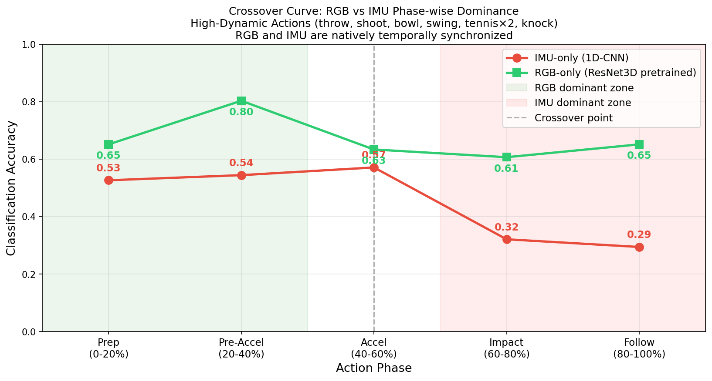
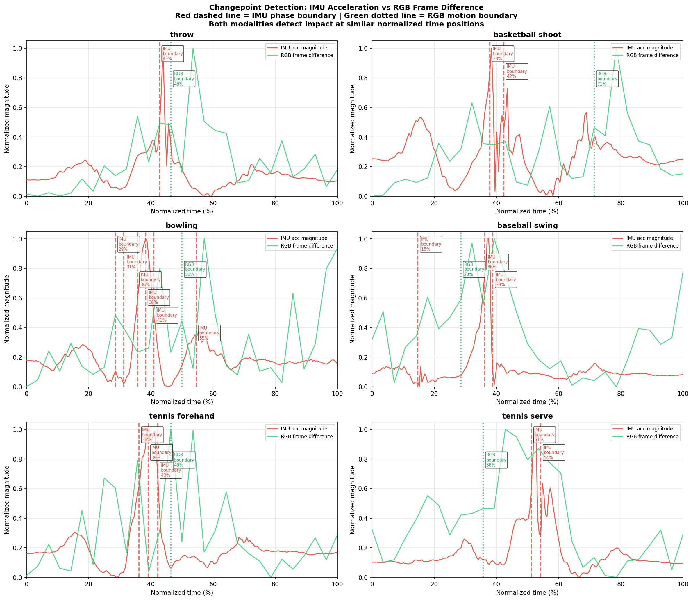

# Multi-Modal AI: Phase-Gated HAR

**Harvard GSD | MAS.S60 / 6.S985 Multimodal AI**  
**Team:** Xiaoyang Wu, Hang Zhao

## Project: Temporal Heterogeneity in Multimodal HAR

We challenge the uniform contribution assumption in multimodal HAR
by introducing **temporal heterogeneity**: the informational dominance
of RGB vision and IMU modalities shifts systematically across
biomechanical phases within a single action.

## Key Results (Midterm)

| Model | Accuracy |
|-------|----------|
| IMU 1D-CNN | 67.9% |
| RGB ResNet3D (pretrained) | 72.8% |
| Skeleton 1D-CNN | 37.9% |

### Crossover Curve

RGB dominates during preparation (80% vs 54%),
both modalities converge at acceleration phase (63% each).

### Changepoint Detection

## Repository Structure
- `project/midterm/code/` - All experiment code
- `project/midterm/figures/` - Result visualizations  
- `project/midterm/report/` - Midterm report PDF

## Key Discovery
RGB and IMU are natively temporally synchronized (<0.5s difference),
while skeleton sequences are systematically shorter by 1.0-1.7s.
This validates RGB as the correct visual modality for aligned analysis.
